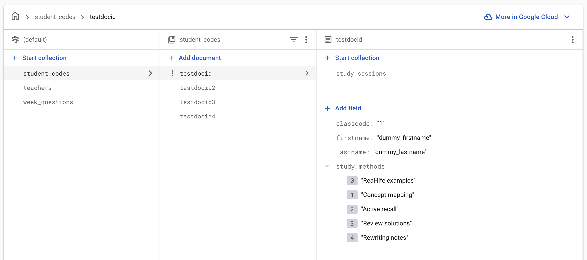
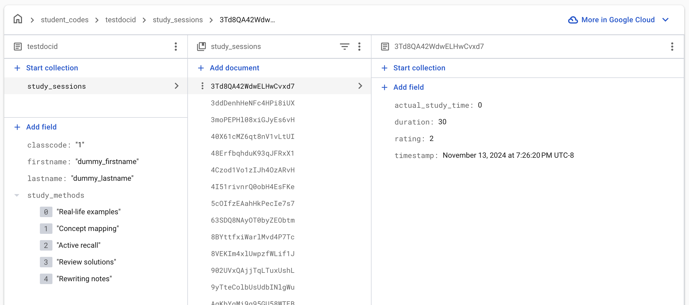

# Learning Log

Learning Log is a cross-platform Flutter application designed to help users track their study methods, manage study sessions, and log their learning progress. The app supports Android, iOS, Windows, macOS, Linux, and Web platforms, leveraging Firebase for authentication and cloud data storage, and SharedPreferences for local state management.

---

## Features

- **User Authentication:** Secure login and registration using Firebase Auth.
- **Study Methods Selection:** Choose from various study methods to personalize your learning.
- **Study Timer:** Built-in timer to manage and track study sessions.
- **Progress Logging:** Log your study sessions and view your progress over time.
- **Cross-Platform:** Runs on Android, iOS, Windows, macOS, Linux, and Web.
- **Persistent State:** Uses SharedPreferences for local data persistence.

---

## Getting Started

### Prerequisites

- [Flutter SDK](https://flutter.dev/docs/get-started/install)
- [Dart SDK](https://dart.dev/get-dart)
- [Firebase Account](https://firebase.google.com/)
- Platform-specific tools (Android Studio, Xcode, etc.)

### Installation

1. **Clone the Repository:**

   ```sh
   git clone https://github.com/your-username/learning_log.git
   cd learning_log
   ```

2. **Install Dependencies:**

   ```sh
   flutter pub get
   ```

3. **Platform Setup:**

   - For **Android**: Open with Android Studio or run `flutter run` with a connected device/emulator.
   - For **iOS**: Open `ios/Runner.xcworkspace` in Xcode, or run `flutter run` on a Mac.
   - For **Web**: Run `flutter run -d chrome`.
   - For **Windows/Linux/macOS**: Ensure desktop support is enabled and run `flutter run`.

---
## Important: Firebase Configuration Files

**Sensitive Firebase configuration files are not included in this repository for security reasons.**

You must add your own Firebase configuration files after cloning the repo:

- `android/app/google-services.json`
- `ios/Runner/GoogleService-Info.plist`
- `macos/Runner/GoogleService-Info.plist`
- `lib/firebase_options.dart`
- `firebase.json`

These files are listed in [.gitignore](.gitignore) and should never be committed to a public repository.

**How to generate these files:**
1. Follow the [Firebase Setup](#firebase-setup) instructions in this README to create your own Firebase project and register your apps.
2. Download the configuration files from the Firebase Console for each platform and place them in the correct directories.
3. Use the [FlutterFire CLI](https://firebase.flutter.dev/docs/cli/) to generate `lib/firebase_options.dart`:
   ```sh
   dart pub global activate flutterfire_cli
   flutterfire configure
   ```

Your app will not run or connect to Firebase services until these files are present and correctly

---

## Firebase Setup

This project uses Firebase for authentication and cloud storage. You must set up your own Firebase project to use the app.

### 1. Create a Firebase Project

- Go to [Firebase Console](https://console.firebase.google.com/).
- Click **Add project** and follow the setup steps.

### 2. Register Your App(s)

- In the Firebase Console, add a new app for each platform you want to support (Android, iOS, Web, etc.).
- Follow the instructions to download the configuration files:
  - **Android:** Download `google-services.json` and place it in `android/app/`.
  - **iOS:** Download `GoogleService-Info.plist` and place it in `ios/Runner/`.
  - **macOS:** Download `GoogleService-Info.plist` and place it in `macos/Runner/`.
  - **Web:** Copy the Firebase config snippet for web.

### 3. Update `firebase_options.dart`

This project uses the [FlutterFire CLI](https://firebase.flutter.dev/docs/cli/) to generate `lib/firebase_options.dart`, which contains your Firebase configuration for all platforms.

### Firebase Schema Setup

To set up your Firebase Firestore database schema as shown in the screenshots, follow these steps:

1. **Create the Main Collection:**
   - In Firestore, create a collection named **student_codes**.

2. **Add Documents for Each Student:**
   - Inside **student_codes**, add a document for each student. The document ID can be a unique identifier (e.g., `testdocid`, `testdocid2`, etc.).
   - Each student document should have the following fields:
     - `classcode`: (string) The class code, e.g., `"1"`
     - `firstname`: (string) The student's first name, e.g., `"dummy_firstname"`
     - `lastname`: (string) The student's last name, e.g., `"dummy_lastname"`
     - `study_methods`: (array of strings) The study methods selected by the student, e.g., `["Real-life examples", "Concept mapping", "Active recall", "Review solutions", "Rewriting notes"]`

3. **Add a Subcollection for Study Sessions:**
   - For each student document, add a subcollection named **study_sessions**.
   - Inside **study_sessions**, each document represents a study session and should have fields like:
     - `actual_study_time`: (number) The actual time spent studying (e.g., `0`)
     - `duration`: (number) The planned duration of the session (e.g., `30`)
     - `rating`: (number) The user's rating for the session (e.g., `2`)
     - `timestamp`: (timestamp) The date and time of the session

4. **Example Structure:**

   ```
   student_codes (collection)
   ├── testdocid (document)
   │   ├── classcode: "1"
   │   ├── firstname: "dummy_firstname"
   │   ├── lastname: "dummy_lastname"
   │   ├── study_methods: ["Real-life examples", "Concept mapping", ...]
   │   └── study_sessions (subcollection)
   │       ├── <session_id> (document)
   │       │   ├── actual_study_time: 0
   │       │   ├── duration: 30
   │       │   ├── rating: 2
   │       │   └── timestamp: <timestamp>
   │       └── ...
   └── ...
   ```

5. **Additional Collections:**
   - You may also see collections like `teachers` or `week_questions` at the root level. These are optional and depend on your goals. I included these to link to a separate website for teachers to upload questions that students are tested on at the end of their study session. 

**Tips:**
- You can add documents and fields using the Firestore web console.
- Make sure your Firestore security rules allow your app to read/write these collections as needed.

This structure as shown below in screenshots will allow your app to store and retrieve user study data:





**To generate or update this file:**

```sh
dart pub global activate flutterfire_cli
flutterfire configure
```

- Follow the prompts to select your Firebase project and platforms.
- This will update `lib/firebase_options.dart` with your project's credentials.

### 4. Enable Required Firebase Services

- In the Firebase Console, enable **Authentication** (Email/Password or other providers you want).
- Enable **Cloud Firestore** for database storage.

---

## Running the App

After completing the Firebase setup:

```sh
flutter run
```

- For a specific platform, use `flutter run -d <device_id>`.

---

## Customization

- **Assets:** Place your images in the `assets/` directory and reference them in `pubspec.yaml`.
- **Study Methods:** Edit `study_methods_selection_page.dart` to add or modify study methods.
- **UI:** Customize the look and feel using Flutter widgets in the `lib/` directory.

---

## Troubleshooting

- If you encounter issues with Firebase, ensure your configuration files are correct and match your Firebase project.
- Run `flutter clean` and `flutter pub get` if you experience build issues.
- For iOS, ensure CocoaPods is installed and run `pod install` in the `ios/` directory.


---

## License

This project is licensed under the MIT License.

---